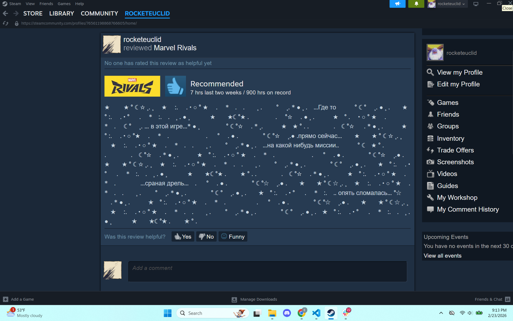
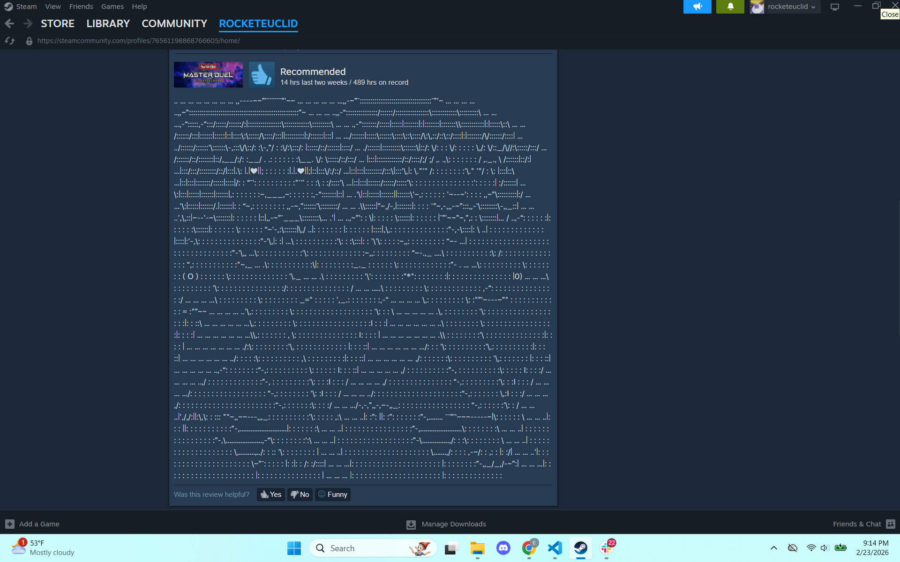
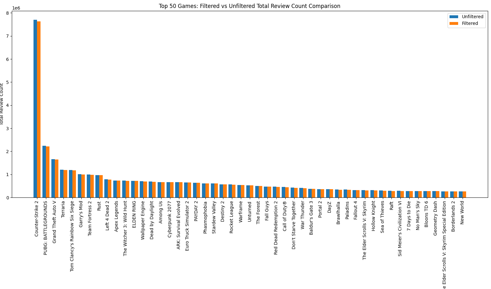
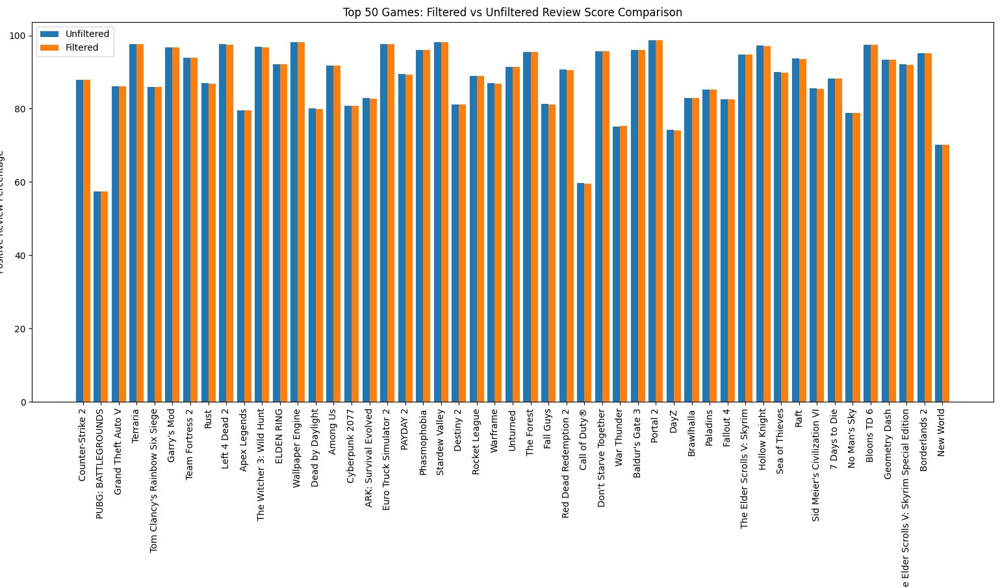
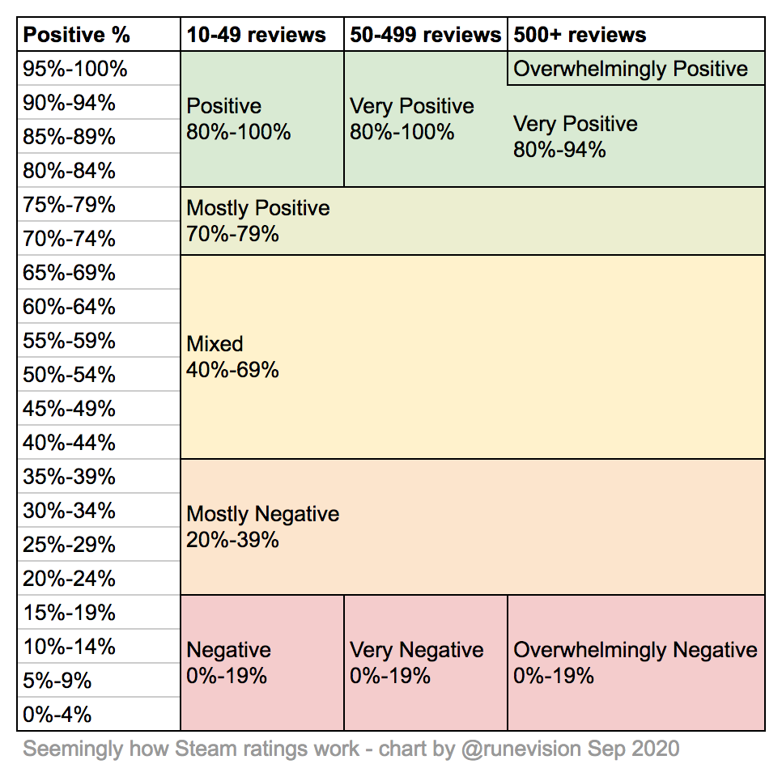
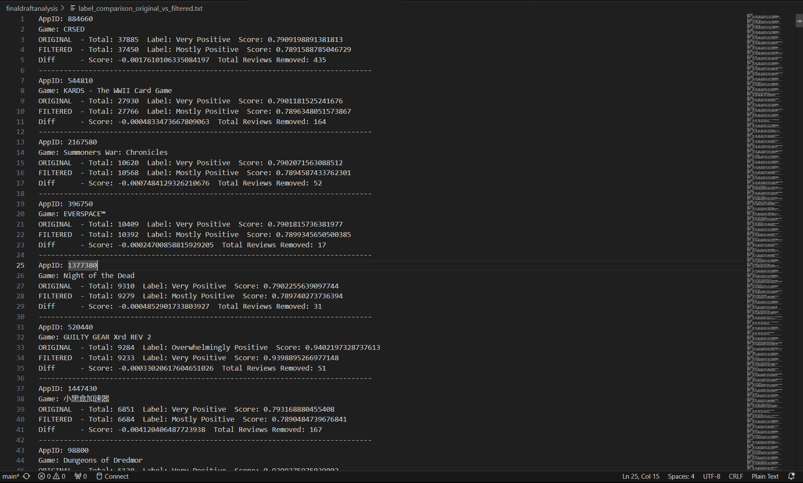

## Intro and Hypothesis
When I initially picked this dataset, I assumed that a lot of the negative reviews on some of my favorite were by people who only play a limited number of game genres. For example, on social media sites like Twitter, there are a lot of people complaining that there aren't any good games nowadays. But after analyzing the dataset, I realized that there are reviews being written by more than just people with bad tastes in games. Many of the reviews talk about something completely different than the game the review is suppose to be based on. My hypothesis has grown from gamers with bad taste leave bad reviews on good games, to strange/duplicate/bot reviews heavily influence the review score for Steam's most popular games

## Types of Reviews
There are over 100 million Steam reviews. There are short reviews that simply say a game is "fun" or "bad". There are reviews that go into detail about what makes the game great and/or what holds it down. Then there are reviews that talk about bees doing what humans consider to be impossible, men named Walter Hartwell forced to make meth for their evil step-brothers, a variety of different recipes for food, and reviews made up entirely of symbols like slashes to create a picture. Below are a few examples

There are thousands of these types of strange reviews that affect a game's score. The question becomes: How do we filter out these strange reviews?

## How I filtered out strange reviews
Initially, I filtered out strange reviews by counting the number of times the same review was said, and if the count was greater than 20, remove all user ids who are associated with that strange review. But what if there is a user who had many genuine reviews, and only 1 or 2strange review? Then all of that user's strange reviews would be filtered out from the dataset, including that user's genuine reviews, which could affect my data analysis. I want to observe how filtering out strange reviews affect a game's review score, not filtering out both strange and genuine reviews. 

To filter out strange reviews from genuine reviews from the dataset as accurately as possible, I focused on both the length of a review, and how many times that review is used. As stated earlier, there are many gamers who leave short reviews like "fun" or "good" or "bad". Even if those reviews show up many times across different games, I will not consider them strange reviews because there are many gamers who want to support a game they feel strongly about, but don't have the time to leave a lengthly review. So instead, what I did was if a review was longer than 20 characters(which avoids short reviews) and it has appeared more than 10 times, in this game and across different others added to the count, then all instances of that strange review except one are removed from the dataset.

For example, from my analysis, this is what the top reviewed game, Counter-Strike-2, looks like with the unfiltered dataset

- Game Title: Counter-Strike 2
    - Positive Reviews: 6771546
    - Negative Reviews: 933107
    - Total Reviews: 7704653
    - Review Label: Very Positive
    - Review Score: 0.878890457493673

And this is what it looks like after filtering out the strange reviews 

- Game Title: Counter-Strike 2
    - Positive Reviews: 6695808
    - Negative Reviews: 929415
    - Total Reviews: 7625223
    - Review Label: Very Positive
    - Review Score: 0.8781130728898027

Looking at the difference between Total Reviews, the difference between them is nearly 80 thousand strange reviews removed. After running my code, I've removed over 930 thousand strange reviews from the dataset across different games.

I graphed the top 50 reviewed games, both unfiltered and filtered to help visualize the difference between total reviews

And this is the positive review comparison between the top 50 games filtered vs unfiltered

## How much do strange reviews affect a game's review label?

When it comes to games to Steam, a game with 90 percent total positive review doesn't mean a game is "overwhelmingly positive". It also takes in total number of reviews into account. For example, if a game has a 95 percent total positive reviews and its total number of reviews is less than 50, its only given a "positive" label. But if it instead has over 500 total reviews and has 95 percent postive reviews, then it is labeled "overwhelmingly positive". I had to make sure my code followed the Steam Label guide for each game that had a certain number of reviws.

After removing over 930 thousand strange reviews, I had hoped it would heavily affect the review score of Steam's most popularly reviewed games, and therefore change the review label on those games; however that was not the case.

## What actually happened after removing all strange reviews

To detect drastic changes to a game's review label, I joined two tables. The first table is made using the unfiltered dataset, and the second table uses the filtered dataset, the resulting table made up only of rows where the review labels between the first two tables are different, ordered by the number of total reviews DESC.

The most reviewed game that had its label changed after filtering was CRSED, with only 38 thousand reviews. And while 38 thousand is a large number, it is small compared to the top 50 games that have over 100 thousand, with the top game having over 7.6 million.

## Conclusion

Filtering out the strange reviews had less impact than I thought on Steam's top reviewed games. It barely made a dent in changing their labels. While the biggest games remain unfazed, smaller games like CRSED and Total War: WARHAMMER - Blood for the Blood God are more supsceiptible to users and bots leaving strange reviews.
